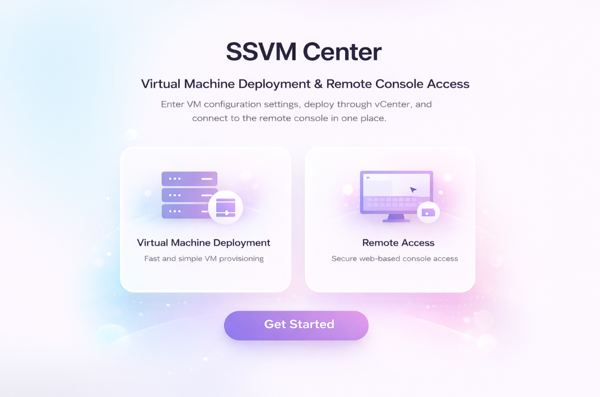
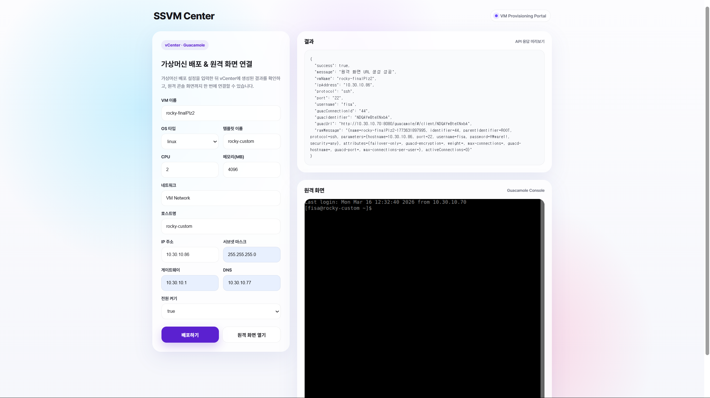

# [ ⚙ VMware VM Provisioning Portal ]


Spring Boot 기반으로 만든 **VMware 가상머신 배포 자동화 웹 포털**입니다.

vCenter에 직접 접속해 템플릿, CPU, 메모리, 네트워크 등을 수동으로 선택하는 대신, 웹 화면에서 배포 정보를 입력하면 **vCenter API를 통해 실제 VM을 생성**하고, 이후 **Guacamole을 이용한 원격 접속 URL까지 생성**할 수 있도록 구현했습니다. 💻

현재는 배포 환경이 아니기에  **Rocky Linux VM 배포**를 기준으로 구성했습니다.

✨ 코드에대한 자세한 설명은 https://zmal.tistory.com/384 을 참고하세요. ✨

***

## 프로젝트 소개 📚

-VMware 환경에서 VM을 여러 대 반복해서 만들어야 하는 경우, vCenter 콘솔에서 매번 직접 설정하는 방식은 시간이 오래 걸리고 실수 가능성도 큽니다.

따라서 이 프로젝트는 반복 작업을 웹 기반으로 자동화하기 위해 만들었습니다. ✨

[사용자]는 웹 페이지에서 VM 이름, CPU, 메모리, IP 등의 정보를 입력하고,  
[백엔드]에서는 이를 받아 vCenter와 통신하여 템플릿 기반으로 VM을 배포합니다.

배포가 끝나면 결과를 반환하고, 원격 접속 정보와 함께 Guacamole 접속 URL을 생성합니다. 🔗

***

## 주요 메서드 ✅


### ⚙️ VM 배포 요청
- 웹 화면에서 VM 배포 요청

### ⚙️ vCenter 연결 및 리소스 검증
- VMware vCenter 연결 테스트
- 배포 대상 리소스 검증
    - Datacenter / Cluster / Network / Datastore / Template

### ⚙️ VM 생성 및 설정
- 템플릿 기반 VM Clone
- CPU / Memory 설정 반영
- 네트워크 재매핑
- Guest Customization 기반 IP 설정

### ⚙️ 결과 조회 및 접속
- 생성된 VM 정보 조회
- Guacamole 원격 접속 URL 생성

### ⚙️ 요청 이력 관리
- VM 배포 요청 이력 DB 저장

***

## 전체 흐름 🔄

```text
웹 UI
  ↓
Spring Boot Controller
  ↓
Service 계층
  ↓
vCenter API 연동
  ↓
Template 기반 VM Clone
  ↓
Guest Customization / 네트워크 설정
  ↓
VM 생성 완료
  ↓
Guacamole API 연동
  ↓
원격 접속 URL 생성
```

***

## 기술 스택 🛠️

| **Category** | Technology |
|---|---|
| **Backend** | Spring Boot |
| **Frontend** | HTML, CSS, JavaScript, Thymeleaf |
| **Database** | PostgreSQL |
| **ORM** | Spring Data JPA |
| **Build Tool** | Gradle |
| **Language** | Java 17 |
| **Virtualization** | VMware vSphere, vCenter |
| **Remote Access** | Apache Guacamole |

***

## 프로젝트 구조 🗂️

```text
src/main/java/com/vmportal
 ┣ config
 ┃ ┣ GuacamoleProperties.java
 ┃ ┣ SecurityConfig.java
 ┃ ┗ VCenterProperties.java
 ┣ controller
 ┃ ┣ PageController.java
 ┃ ┣ ProvisionRequestController.java
 ┃ ┗ VCenterController.java
 ┣ dto
 ┃ ┣ CreateGuacSessionRequest.java
 ┃ ┣ CreateProvisionRequestDto.java
 ┃ ┣ DeployVmRequest.java
 ┃ ┣ GuacConnectionCreateRequest.java
 ┃ ┣ GuacConnectionCreateResponse.java
 ┃ ┣ GuacLoginResponse.java
 ┃ ┗ OpenRemoteConsoleRequest.java
 ┣ entity
 ┃ ┣ ProvisionRequest.java
 ┃ ┗ ProvisionStatus.java
 ┣ repository
 ┃ ┗ ProvisionRequestRepository.java
 ┣ service
 ┃ ┣ GuacamoleService.java
 ┃ ┣ ProvisionRequestService.java
 ┃ ┗ VCenterService.java
 ┗ VmportalApplication.java

src/main/resources
 ┣ templates
 ┃ ┣ deploy-form.html
 ┃ ┣ form.html
 ┃ ┣ requests.html
 ┃ ┗ css.css
 ┗ application.yml
```

***

## 사용한 VMware API 🖥️

이 프로젝트는 **Java 기반 VMware SDK**를 사용하여 vCenter와 통신합니다.  
구현 과정에서 주로 사용한 클래스는 다음과 같습니다.

| 클래스                          | 역할                                                   |
| ---------------------------- | ---------------------------------------------------- |
| `ServiceInstance`            | vCenter 서버 연결                                        |
| `InventoryNavigator`         | Datacenter, Cluster, Network, Datastore, Template 검색 |
| `VirtualMachine`             | VM 조회 및 제어                                           |
| `VirtualMachineCloneSpec`    | VM Clone 설정                                          |
| `VirtualMachineRelocateSpec` | Datastore / Resource Pool 설정                         |
| `VirtualMachineConfigSpec`   | CPU / Memory 설정                                      |
| `CustomizationSpec`          | Guest OS IP / Hostname 설정                            |
| `Task`                       | VM 생성 작업 실행                                          |

즉, vCenter UI에서 하던 작업을 코드로 자동화한 구조입니다.

***

## 사용한 Guacamole API 🌐

원격 접속 기능은 **Apache Guacamole REST API**를 이용해 구현했습니다.

| API                                          | 역할            |
| -------------------------------------------- | ------------- |
| `/api/tokens`                                | Guacamole 로그인 |
| `/api/session/data/{datasource}/connections` | 원격 접속 연결 생성   |

Guacamole API를 통해 VM 생성 이후 SSH 또는 RDP 접속용 Connection을 만들고,  
브라우저에서 바로 열 수 있는 URL을 생성합니다.

***

## application.yml 예시 📄

> 실제 운영 환경에서는 비밀번호나 주요 접속 정보는 환경 변수로 분리해야 합니다. <br>
> 실제 vCenter, DB, Guacamole 접속 변수를 넣어주세요.
> 아래 예시는 로컬 테스트용입니다. ⚠️

```yml
spring:
  datasource:
    url: jdbc:postgresql://localhost:5432/vm_portal
    username: postgres
    password: 1234
    driver-class-name: org.postgresql.Driver

  jpa:
    hibernate:
      ddl-auto: update
    show-sql: true
    properties:
      hibernate:
        format_sql: true

  thymeleaf:
    cache: false

server:
  port: 8080

vcenter:
  url: https://10.30.10.102/sdk
  username: administrator@seoul.seung.fisa
  password: VMware1!
  datacenter: Seoul-DC
  cluster: Seoul-Cluster
  network: VM Network
  datastore: vsanDatastore
  rocky-template: rocky-template

guacamole:
  base-url: http://10.30.10.70:8080/guacamole
  username: guacadmin
  password: guacadmin
  datasource: mysql
```

***

## 실행 방법 ▶️

### 1. PostgreSQL 실행

Docker Compose로 DB를 먼저 실행합니다.

```bash
docker compose up -d
```

### 2. Spring Boot 실행

```bash
./gradlew bootRun
```

Windows 환경에서는:

```bash
gradlew.bat bootRun
```

### 3. 접속

브라우저에서 아래 주소로 접속합니다.

```text
http://localhost:8080/deploy-form
```


***

## 핵심 구현 포인트 🔍

### 1. 설정값 분리

`application.yml`의 값을 `@ConfigurationProperties`로 바인딩하여  
vCenter와 Guacamole 설정을 객체 형태로 관리했습니다.

### 2. Entity 기반 이력 관리

`ProvisionRequest` 엔티티를 통해 배포 요청 정보, 상태, VM 정보, 원격 접속 정보, 에러 메시지를 함께 저장했습니다.
### 3. DTO 분리

웹 요청용 DTO와 내부 배포 로직용 DTO를 분리하여  
외부 요청 형식과 내부 처리 구조가 섞이지 않도록 구성했습니다.

### 4. 템플릿 기반 VM Clone

VMware Template을 기준으로 새 VM을 생성하고,  
배포 시점에 CPU / Memory / Network / IP 설정을 반영할 수 있도록 했습니다.

### 5. Guacamole 연동

VM 생성 후 Guacamole 연결을 자동으로 생성해  
웹 브라우저에서 바로 원격 접속할 수 있도록 했습니다.

***

## 한계 및 개선 포인트 🧪

현재 프로젝트는 테스트 목적상 다음과 같은 제한이 있습니다.

* Rocky Linux 템플릿 기준으로 우선 구현
* 비밀번호 및 접속 정보 일부 하드코딩
* Guacamole 연결 생성 시 계정 정보 고정
* 운영 환경용 보안 처리 미적용

향후에는 아래와 같이 확장할 수 있습니다.

* Windows / Ubuntu 등 다중 템플릿 지원
* 환경 변수 기반 보안 설정 분리
* 사용자별 인증 및 권한 관리
* 배포 이력 조회 UI 고도화
* 비동기 상태 추적 및 Task Polling 개선

***

## 느낀 점 💭

이번 프로젝트는 단순히 화면을 만드는 것이 아니라,  
**vCenter에서 수행하던 인프라 작업을 웹 서비스와 연결해 자동화했다는 점**에서 의미가 있었습니다.

특히 다음 두 가지를 함께 다룰 수 있었습니다.

* VMware vSphere API를 이용한 VM Provisioning 자동화
* Apache Guacamole REST API를 이용한 웹 기반 원격 접속 자동화

즉, 이 프로젝트는 단순한 CRUD 웹 프로젝트가 아니라  
**가상화 인프라와 백엔드 서비스를 연결한 자동화 포털**이라고 볼 수 있습니다. 🌉

***

## 참고 📎

* VMware vSphere Web Services SDK
* VMware Developer Portal
* Apache Guacamole REST API

***

## Author 👩‍💻

**SeoJiHye**
